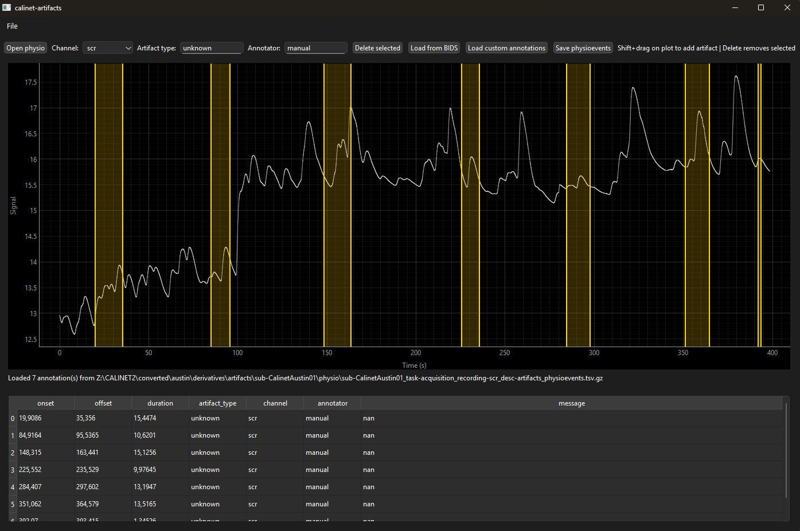

# calinet-artifacts



A lightweight tool for **annotating physiological signal artifacts** and
exporting them in a **BIDS-compatible physioevents format**.

## ✨ Features

-   Interactive GUI for annotation
-   Shift+drag artifact creation
-   Editable table
-   BIDS-compatible export
-   MATLAB → physioevents conversion

## 🚀 Usage

Launch GUI:

    calinet-artifacts --file path/to/file_physio.tsv.gz

## 📁 Output

Exports: - \*\_physioevents.tsv.gz - \*\_physioevents.json

## 🔄 MATLAB Conversion

``` python
from calinet_artifacts.export import mat_to_physioevents_df

mat_to_physioevents_df("artifacts.mat")
```
